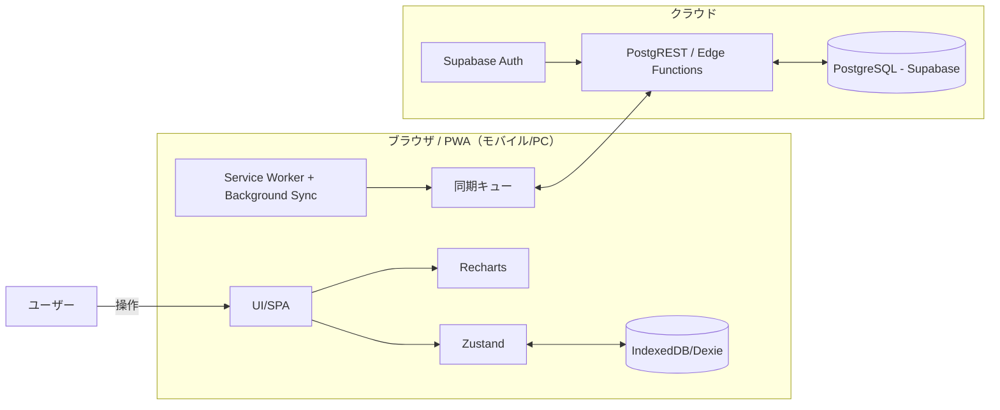

# 家計簿アプリ アーキテクチャ設計（外出先入力・PC閲覧前提）

上記要件をベースに、**外出先で素早く入力（モバイル）**し、**PCで閲覧・分析**する前提のアーキテクチャ。  
基本は**オフラインファースト**で即入力→**オンライン時に自動同期**する構成。

## 制約
- 個人開発（1人）
- 低コスト重視（無料枠中心）
- 運用簡単（サーバレス／マネージド）

---

## 技術スタック
- **フロントエンド**: React + Vite + PWA（Service Worker, Background Sync） + Zustand（状態管理） + Recharts（グラフ）
- **バックエンド**: Supabase（Edge Functions 任意）+ REST（PostgREST）
- **データベース**: IndexedDB（ローカルキャッシュ/Dexie） + （同期先）PostgreSQL（Supabase）
- **認証**: Supabase Auth（Magic Link or GitHub OAuth）※単ユーザー想定・許可リストで制限
- **インフラ**: Cloudflare Pages（静的ホスティング） + Supabase（DB/認証/ストレージ/リアルタイム）
- **その他**: Web Crypto（将来のバックアップ暗号化用, 任意）, Sentry（任意）

> ねらい：**入力の瞬発力＝ローカル書き込み**＋**複数端末連携＝同期** を両立。秘密鍵はフロントに置かず、Authで保護。

---

## システム構成図
### オフラインファースト＋同期あり

---

## 選択理由
- **React + PWA**: 起動が速く、**オフライン即入力**が可能。配布も容易（URLでOK）。
- **IndexedDB（Dexie）**: 入力遅延ゼロ、機内モードでも動く。リスト/検索のローカル体験が軽い。
- **Supabase（PostgreSQL）**: 無料枠で十分・**認証/DB/APIが一体**でセットアップが最小。将来拡張が楽。
- **Background Sync**: オンライン復帰時に**自動アップロード/ダウンロード**。ユーザー操作を止めない。

---

## 初期コスト（月額）
- Cloudflare Pages（静的ホスティング）: **$0**
- Supabase（Free tier）: **$0**（DB/認証/ストレージ/Edge Functions）
- 合計: **$0/月**（利用増で随時見直し）

---

## 同期・データ整合方針（簡易）
- **書き込み**: まずIndexedDBへ保存→同期キューへ積む→オンライン時にAPIへPOST。
- **読み込み**: 起動時はIndexedDBから即描画→バックグラウンドで差分取得→LocalDBを更新。
- **ID/衝突**: クライアント生成UUID + `updated_at`で**最新勝ち**。削除は論理削除（is_deleted）。
- **カテゴリ**: 初期5分類はサーバにシード、将来はユーザー定義カテゴリをテーブルで拡張可能。

---

## セキュリティ（MVP方針）
- HTTPS配信。Authは**Magic Link**（メールリンク）またはGitHub OAuth。**許可メールのみ**ログイン可。
- RLS（Row Level Security）で**自分のデータのみ**アクセス可能。
- ローカルDBは端末ロックに依存。バックアップ実装時のみ**エクスポート暗号化**を検討。

---

## 開発・運用メモ
- CI/CD: GitHub → Cloudflare Pages 自動デプロイ。Supabaseは移行不要のマイグレーション管理（SQL）。
- エラーログ: コンソール+（任意）Sentry。性能計測は軽めに。
- フィーチャーフラグ: 将来機能（予算/添付）をフラグで切替可能に。
