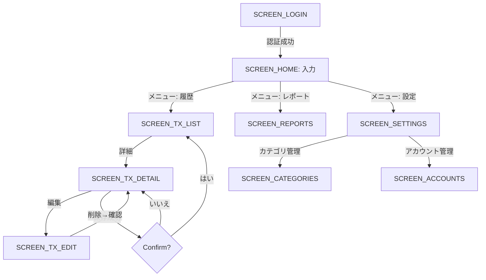
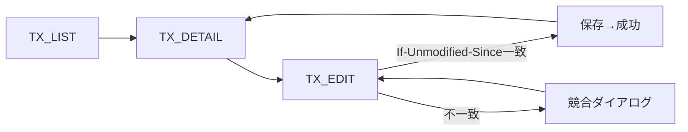

# 画面遷移図（家計簿アプリ：モバイル即入力／PC閲覧）

認証後すぐ**支出入力（ホーム）**が開く前提。モバイル＝入力最優先、PC＝閲覧・分析最適化。  
オフラインでも入力可、オンライン時に自動同期。

---

## 0. 目的と範囲
- **目的**: 普段は「開いて即入力」。必要時にメニューから設定・レポートを参照するUIフローを定義する。  
- **対象**: Web/PWA（モバイル・PC）フロントの画面・遷移。  
- **非対象**: バックエンド詳細、スタイルガイド詳細。

---

## 1. 前提
- **プラットフォーム**: Web（PWA）
- **ナビゲーション**: 上部アプリバーに**メニュー（⋯）**、ホームに**クイック入力フォーム**。PCでは左に一覧、右に入力の**2ペイン**（可）。
- **認証**: 必要（未認証時は /login へ）。
- **URL/ルーティング規約**: `/login`, `/`(HOME:入力), `/transactions`, `/reports`, `/settings`, `/categories`, `/accounts`, `/transactions/:id`。
- **デザイン原則**: 1画面1主要タスク / 片手入力 / 即保存のフィードバック（トースト）。

---

## 2. スクリーン一覧
| Key | 画面名 | Route/URL | 目的 | 主要コンポーネント | 備考 |
|---|---|---|---|---|---|
| SCREEN_LOGIN | 認証 | /login | サインイン | メール/OTP or OAuth | 認証成功で直前URLへ |
| SCREEN_HOME | 入力（ホーム） | / | **即入力** | 金額・日付・メモ・支払元・カテゴリ（複数）・保存ボタン / 最近の入力 | モバイル初期表示 |
| SCREEN_TX_LIST | 取引一覧 | /transactions | 履歴参照/検索 | 検索・フィルタ・リスト | PCではホームと2ペイン可 |
| SCREEN_TX_DETAIL | 取引詳細 | /transactions/:id | 詳細参照 | 詳細カード/編集導線/削除 | |
| SCREEN_TX_EDIT | 取引編集 | /transactions/:id/edit | 修正/更新 | 入力フォーム | |
| SCREEN_REPORTS | レポート | /reports | 月次/年次の可視化 | 円/棒グラフ・期間切替 | |
| SCREEN_SETTINGS | 設定 | /settings | アプリ設定 | テーマ/小数/表示/ロック | |
| SCREEN_CATEGORIES | カテゴリ管理 | /categories | 追加/並び替え | リスト・編集 | |
| SCREEN_ACCOUNTS | アカウント管理 | /accounts | 支払元管理 | 追加/有効化 | 任意 |

---

## 3. 状態バリエーション（Empty/Loading/Error/Offline）
| Key | Empty表示 | Loading表示 | Error表示 | Offline時の振る舞い |
|---|---|---|---|---|
| SCREEN_HOME | 初回ガイド（例：カテゴリセットアップ） | スケルトン | 保存時エラーをトースト | **ローカル保存→同期キュー**投入 |
| SCREEN_TX_LIST | 「まだ取引がありません」+ 入力ショートカット | スケルトン | リトライ | キャッシュ一覧を表示 |
| SCREEN_REPORTS | 「データが足りません」メッセージ | スケルトン | リトライ | キャッシュ集計 or 非表示 |

---

## 4. 主要アクション一覧
| アクション | From画面 | To画面 | 条件/ガード | 成功時 | 失敗時 |
|---|---|---|---|---|---|
| 即入力→保存 | HOME | HOME（継続入力） | 必須OK | トースト/フォームリセット/直前値保持設定 | バリデーション表示 |
| 一覧へ | HOME | TX_LIST | なし | スクロール位置保持 | - |
| 詳細へ | TX_LIST | TX_DETAIL | ID存在 | - | 404表示 |
| 編集→保存 | TX_EDIT | TX_DETAIL | If-Unmodified-Since一致 | トースト/再取得 | 競合ダイアログ |
| 削除 | TX_DETAIL | TX_LIST | 確認OK | 論理削除→一覧反映 | アラート |

---

## 5. モーダル / ダイアログ / シート
| Key | 種別 | 起点 | 目的 | 主なボタン |
|---|---|---|---|---|
| MOD_CONFIRM_DELETE | Dialog | TX_DETAIL | 削除確認 | 削除/キャンセル |
| SHEET_FILTER | BottomSheet | TX_LIST | フィルタ | 適用/クリア |
| MOD_CATEGORY_PICKER | Modal | HOME | 複数カテゴリ選択（均等按分） | 決定/キャンセル |

---

## 6. ディープリンク / 共有URL
- `/transactions/:id` は認証済なら TX_DETAIL を開く。未認証時は `/login` → 成功後に復帰。

---

## 7. 画面遷移図（Mermaid）


---

## 8. 主要ユーザーフロー（Mermaid）
### A) **開いて即入力→保存**（オフライン対応）
```mermaid
flowchart LR
  A[HOME: 入力] -->|保存| B{必須OK?}
  B -->|NO| A[エラーメッセージ]
  B -->|YES| C{オンライン?}
  C -->|NO| D[IndexedDB保存+同期キュー] --> E[トースト: 保存(オフライン)] --> A[フォームリセット/継続入力]
  C -->|YES| F[API保存] -->|成功| G[トースト: 保存] --> A
  F -->|失敗| H[ローカルに保存しキューへ] --> E
```

### B) 一覧→詳細→編集→保存


---

## 9. レスポンシブ（モバイル/PC差分）
| Key | モバイル | PC |
|---|---|---|
| HOME | **全面が入力フォーム** + 直近の入力（下部） | **左：一覧 / 右：入力フォーム（2ペイン）** |
| TX_LIST | ライトなカードリスト/無限スクロール | テーブル + サイド詳細（行選択で右ペイン） |
| REPORTS | タブで月次/年次切替 | ワイドな比較グラフ/期間プリセット |
| SETTINGS | セクションをアコーディオン | 2カラムフォーム |

**キーボードショートカット（PC）**  
- `N` 入力フォームへフォーカス、`Enter` で保存、`/` 検索へ。

---

## 10. 認証/権限ガード
- 未認証アクセス：`/login` へリダイレクト。認証後は**元URLに戻す**。  
- 所有者チェック失敗：`403` 表示。

---

## 11. 非同期・オフライン/同期
- **保存**：IndexedDBへ即時書き込み → **Background Sync** でサーバへPOST。  
- **一覧**：起動時はキャッシュ表示 → バックグラウンドで差分取得。  
- **競合**：`updated_at` で最新勝ち。編集中に不一致ならダイアログ提示。

---

## 12. アクセシビリティ
- フォーカス可視・タブ移動で主要操作完遂。  
- チャートには数値ラベル/テーブル代替。  
- ラベル色は自動切替（高コントラスト）。

---

## 13. イベント / トラッキング（任意）
- `view_home`, `save_tx_success`, `save_tx_error`, `view_reports`, `apply_filter` など（ローカルログでOK）。

---

## 14. 用語と略語
- **取引（Transaction）**: 1回の支出。  
- **スプリット（Split）**: 1取引を複数カテゴリに按分した要素。

---

## 15. 変更履歴
- 2025-09-26: 初版作成
